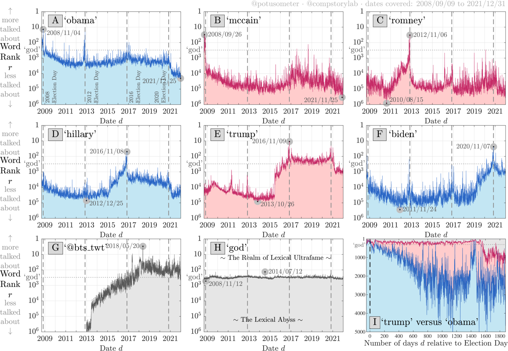

```{r setup, include=FALSE}
options(htmltools.dir.version = FALSE)
library(knitr)
opts_chunk$set(
  fig.align="center",  
  fig.height=4, #fig.width=6,
  # out.width="748px", #out.length="520.75px",
  dpi=300, #fig.path='Figs/',
  cache=T#, echo=F, warning=F, message=F
  )
library(tidyverse)
library(hrbrthemes)
library(fontawesome)
```


# Introduction

### Course

`r fa('globe')` Link to Github

This course profited a lot from existing materials by

.pull-left[
- [Data science for economists](https://github.com/uo-ec607) by Grant McDermott 

- [Bit by Bit](https://www.bitbybitbook.com/en/1st-ed/preface/) by Matt Salganic

- [Digital Trace Data](https://sicss.io/2022/oxford/schedule) by Ridhi Kashyap
]

.pull-right[
- [Webscraping Introduction](https://github.com/theresagessler/warwick_scraping/blob/master/gessler_slides.pdf) by Theresa Gessler

- [Computational Social Science](https://bookdown.org/paul/2021_computational_social_science/) by Paul Bauer
]

--

### Me

`r fa('address-book')` [Tobias Rüttenauer](https://ruettenauer.github.io/)

`r fa('envelope')` [t.ruttenauer@ucl.ac.uk](mailto:t.ruttenauer@ucl.ac.uk)

`r fa('graduation-cap')` Lecturer in Quantitative Social Science (Environmental Sociology)

---

# Digital Trace Data

### Social transformation:
- Digital technologies permeate social, economic, political life.
- A lot of social interactions happen in the digital world.

### Data revolution:
- The digitalisation of our lives creates data by-products: digital trace data.
- Data that require __repurposing__ because they were not intentionally collected for research.
- Existing data may require a lot of thoughts and work to fit your purpose.

### Research revolution:
- Ask the right questions!
- Huge amounts of (big) data, but: __What things are worth counting?__

---

# Digital Trace Data

### Social research data in a digital age


---
# Digital Trace Data

.pull-left[
### Strenghs of Trace Data

- Big
- Always on
- Actual behaviour
- Non-reactive
- Captures social relations
- Mergable (e.g. geo-coordinates)
.pull.left[

[Dodds et al, ArXiv](https://arxiv.org/pdf/2008.07301.pdf)
]

]

--

.pull-right[
### Weaknesses of Trace Data

- Incomplete & Inaccessible
- Non-representative & Selective
- Drifting
- Algorithmically confounded
- Dirty
- Sensitive to privacy issues
.pull.left[

[Lazer et al, Science](https://www.science.org/doi/10.1126/science.1248506#F2)
]

]

---
# Examples

### The Decline and Persistence of the Old Boy: Private Schools and Elite Recruitment


[Reeves et al., American Sociological Review](https://journals.sagepub.com/doi/10.1177/0003122417735742)


---
# Examples

### Matthew Effect & Cumulative Status Bias in NBA All-Star Elections 

- based on 1.2 million game logs from the 3,300 players ([www.basketball-reference.com/](https://www.basketball-reference.com/))

.pull-left[

]

.pull-right[

]

[Biegert et al., American Sociological Review](https://journals.sagepub.com/doi/10.1177/00031224231159139)


---
# Examples

### Estimating Migrant Stocks Using Digital Traces and Survey Data


[Rampazzo et al., Demography](https://doi.org/10.1215/00703370-9578562)


---
# Examples

.pull-left[
### Population Studies: Authors and topics over the past 75 years


]


.pull-right[
### 


]

[Mills & Rahal., Population Studies](https://www.tandfonline.com/doi/full/10.1080/00324728.2021.1996624)


---
# Examples

### Increase in Discrimination Against Arabs and Muslims on AirBnB after Paris Attacks


[Wagner & Petev, Working Paper](https://crest.science/RePEc/wpstorage/2019-22.pdf)


---
# Accessing Digital Trace Data

### 1) Web (Screen) scraping

### 2) Data from application programming interfaces (APIs)

### 3) Archives or data sharing platforms 
- e.g. [Google Trends](https://trends.google.com/home), [IPUMS](https://www.ipums.org/), [Our World in Data](https://ourworldindata.org/), [London Datastore](https://data.london.gov.uk/)

### 4) Data sharing agreements with data owners 
- e.g. [UK Data Service](https://ukdataservice.ac.uk/), or commercial platforms


---
class: inverse, center, middle
name: started

# Web Scraping

---
# What is webscraping?

### Extracting data from webpages
- Anything from university webpage and geographic information to social media
- Lots of different techniques
- Process unstructured (messy) data and make structured (data.table)
- __ ~ Automated copy & paste__

--

### Types of scraping
- Gathering as diverse information as possible from different pages vs.
- Very specific scrapers
- Fully automated scrapers to half-automated scripts
- Single-use scraping vs. regular data collection

--

### Sofware for scraping
- Python
- R & Rstudio

---
# Current debates about scraping

### Is scraping legal?
- Read the website’s Terms of Service: are you allowed to do this?
- Larger websites like Facebook, Instagram, NY Times do not allow these practices
- However, a recent [LinkedIn court case in th US](https://en.wikipedia.org/wiki/HiQ_Labs_v._LinkedIn) allows webscraping
- Just because you can scrape it, doesn’t mean you should

--

### Is scraping ethical?
- are the data sensitive? 
- Could the use of the data harm in some way?
- freely accessible content vs. commercial content


---
# The rules of the game

### Respect the hosting site’s wishes
- Check if an API exists or if data are available for download
- Keep in mind where data comes from and give credit (and respect copyright if you want to republish the data!)
- Some websites disallow scrapers on robots.txt file

--

### Limit your bandwidth use
- Wait one or two seconds after each hit
- Scrape only what you need, and just once (e.g. store the file on disk, and then parse it)
- …otherwise you’ll get a visit from the IT guys! (e.g. scraping articles)

--

### Respect data protection
- Secure storage vs. deletion of data
- Anonymization of users 


---
# Browsing vs. scraping

### Browsing
- You click on something
- Browser sends request to server that hosts webpage
- Server returns resource (e.g. HTML document)
- Browser interprets HTML and renders it in a nice fashion

--

### Scraping with R
- You manually specify a resource
- R sends request to server that hosts website
- Server returns resource
- R parses HTML (i.e., interprets the structure), but does not render it in a nice fashion
- You tell R which parts of the structure to focus on and what to extract

--

First step is to __understand some HTML__


---
#  HTML: a primer

### HTML is text with marked-up structure, defined by __tags__:

```{html}
<!DOCTYPE html>
<html>
<body>
<h1>My First Heading</h1>
<p>My first paragraph.</p>
</body>
</html>
```

--

### Some common tags:
- Document elements: `<head>`, `<body>`, `<footer>`…
- Document components: `<title>`, `<h1>`, `<p>`, `<div>`…
- Text style: `<b>`, `<i>`, `<strong>`…
- Hyperlinks: `<a href="url">`

### General structure
- `<tagname>Content goes here...</tagname>`


---
#  Inspect your website

### CSS
- Cascading Style Sheets (CSS): describes formatting of HTML components 
- _Properties_. CSS properties are the “how” of the display rules. These are things like which font family, styles and colours to use, page width, etc.
- _Selectors_. CSS selectors are the “what” of the display rules. They identify which rules should be applied to which elements. E.g. Text elements that are selected as “.h1” (i.e. top line headers) are usually larger and displayed more prominently than text elements selected as “.h2” (i.e. sub-headers).
- The key point is that if you can identify the CSS selector(s) of the content you want, then you can isolate it from the rest of the webpage content that you don’t want. This where SelectorGadget comes in.

### SelectorGadget
- [SelectorGadget](https://selectorgadget.com/) as Chrome Extension
- Inspect option in Chrome


---
#  Inspect your website

### Wikipedia Example
 - [https://en.wikipedia.org/wiki/List_of_countries_by_life_expectancy](https://en.wikipedia.org/wiki/List_of_countries_by_life_expectancy)


---
#  Inspect your website

### Wikipedia Example
 - Use inspect option to select table
 - copy Xpath
 - In this case: `//*[@id="mw-content-text"]/div[1]/table[1]`


---
#  Scrape the website

### R Package `rvest`
 - Package for parsing and scraping
 - Covers most frequent use cases
 - but relatively simple: no dynamic webpages
 
[rvest Vignette](https://cran.r-project.org/web/packages/rvest/vignettes/rvest.html) 

### Some important commands
- `read_html()`
- `html_nodes()` 
- `html_elements()` 
- `html_text2()`
- `html_table()`
- `html_attrs()`

---
#  Example 1: Wiki

### Parsing the url of the website

```{r warning=FALSE}
library(rvest)
library(xml2)
url <- "https://en.wikipedia.org/wiki/List_of_countries_by_life_expectancy"
parsed <- read_html(url)
```

This returns an xml object that contains all the information of the website.

```{r}
parsed
```


---
#  Example 1: Wiki

### Extract the information we need

- we use the xpath that we have extracted above

```{r warning=FALSE}
# Select the desired element
parsed.sub <- html_element(parsed, xpath = '//*[@id="mw-content-text"]/div[1]/table[1]')

# Convert to table
table1.df <- html_table(parsed.sub)   

head(table1.df)
```

---
#  Example 1: Wiki

### Some cleaning

- it always makes sense to clean the columns names

```{r message=FALSE, warning=FALSE}
library(janitor)

# clean names
names(table1.df) <-  janitor::make_clean_names(names(table1.df))

# Delete empty rows
empt <- apply(table1.df, 1, FUN = function(x) all(is.na(x) | x == ""))
table1.df <- table1.df[which(!empt), ]

head(table1.df)
```


---
#  Example 2: Starwars

### Wiki Example

- Wikipedia pages have a specific structure
- Data is stored in tables
- We can extract these tables

### Real world

- Websites are often "unstructured"
- See for instance [https://rvest.tidyverse.org/articles/starwars.html]("https://rvest.tidyverse.org/articles/starwars.html")
- We need to use some generic selectors to structure the data

---
#  Example 2: Starwars


```{r message=FALSE, warning=FALSE}
starwars <- read_html("https://rvest.tidyverse.org/articles/starwars.html")

# Extracting each section
films <- html_elements(starwars, "section")

films

# We have a structure now, but we need to extract the elements

# Extract titles (which are all headings order 2 -> h2)
titles <- html_elements(films, "h2")
titles <- html_text2(titles) # Transform into plain text
```


---
#  Example 2: Starwars

- Extract titles and dates using [CSS rules](https://www.w3.org/TR/2011/REC-css3-selectors-20110929/) 

- Use [regular expressions](https://cran.r-project.org/web/packages/stringr/vignettes/regular-expressions.html) to select correct lines

```{r message=FALSE, warning=FALSE}

# Extract dates
dates <- html_text2(html_elements(films, "p"))
dates <- dates[grepl("^Released", dates)] # Subset to lines beginning with "Released"

# Alternatively we can select the paragraph after heading 2
dates <- html_text2(html_elements(films, "h2 + p"))
dates <- gsub("^Released: ", "", dates) # clean text

head(data.frame(titles, dates))
```

---
# CSS selector rules

### Simple rules

.small[
|Basic selector | Kind | Description|
|--------|----------------|---------------------------|
|* | Universal selector | Matches all elements|
|name | Type selector | For any given name, matches all elements with that tag name.|
|.name | Class selector | Matches all elements whose class attribute includes the word name.|
|#name | ID selector | Matches all elements whose id attribute is exactly name.|
|[attr] | Attribute selector | Matches all elements having an attribute named attr.|
|[attr=value] | Attribute selector | Matches all elements having an attribute named attr whose value is value.|
|[attr="value"] | Attribute selector | Same. With quotes around value, it may contain spaces and punctuation.|
|:nth-child(n) | Pseudo-class | Matches all elements that are child number n (ignoring text and attribute nodes) under their parent.|
|:nth-of-type(n) | Pseudo-class | Matches all elements that are child number n of that same tag name under their parent.|
]

---
# CSS selector rules

### Rule combinations

.small[
|Selector combination | Name | Description|
|------|------|-------------------------------|
|C > T | Child | Only match T when it is a child of an element matched by C.|
|C T | Descendant | Only match T when it is a descendant of an element matched by C.|
|C + T | Adjacent sibling | Only match T when it immediately follows C as C’s sibling.|
|C ~ T | Sibling | Only match T when it is a sibling of C (regardless of order).|
]

See more [CSS rules here](https://www.w3.org/TR/2011/REC-css3-selectors-20110929/) 

---
#  Why scraping?

.container[.content[__Why scraping? I could just copy and paste this!__]]

---
#  for() loops

### for() loops let you

- run the same code along a series of indices `i`
- run the same code across the elements of a vector (e.g. names / dates / urls)
- repeat the same (scraping) task for multiple pages in seconds


```{r}
for(i in c(1:3)){
  pi <- paste0("https://nonsense/p", i)
  print(pi)
  Sys.sleep(2) # Sleep for 2 seconds before next task
}
```

- If you scrape inside a loop, __don't overwhelm the server side!__

- use `Sys.sleep()` to __pause between tasks!__


---
# Web Scraping Summary

### Extracting data from webpages
- Anything from university webpage and geographic information to social media
- Lots of different techniques
- Huge amounts of (big) data, Ask the right questions!
- Respect the rules of the game

### Limits

- Simple examples. Often web pages are complex with many different elements.
- Yielding messy data.
- Web / Screen scraping can be frustrating or unfeasible. What then?
  * For complex web pages, crowd worker platforms (e.g. Mechanical Turk) could be an option.
  * Some web data can be accessed via APIs.

---
class: middle, center, inverse
#  APIs


---
# APIs

### What is an API?
- Application programming interfaces or APIs are a software intermediary that allows two applications to talk to each other.
- Web APIs allow one computer (a client) to ask another computer (a server) for some resource over the internet.
- APIs provide a structured way to access data that are stored in databases that are continuously updated.

--

### Advatages 
- Modern APIs adhere to standards, that make data exchange programmatically accessible, safe and structured
- Contrast with web scraping.
- Two important concepts when using APIs
  * Credentialling
  * Rate limiting
  
  
---
# APIs - how it works

- Let's get some [World Bank Data](https://databank.worldbank.org/home.aspx) 

1) Search for indicators you want

```{r warning=FALSE}
library(WDI)

# Search GDP per capita
WDIsearch("GDP.*capita.*constant")

# Search GDP per capita
WDIsearch("CO2.*capita")

```

---
# APIs - how it works

2) Query the indicators

```{r eval=FALSE, warning=FALSE}
# Define countries, indicators form above, and time period
wd.df <- WDI(country = "all", 
             indicator = c('population' = "SP.POP.TOTL", 
                           'gdp_pc' = "NY.GDP.PCAP.KD", 
                           'co2_pc' = "EN.ATM.CO2E.PC"),
             extra = TRUE,
             start = 2019, end = 2019)

```


3) Clean the data if necessary and plot

```{r warning=FALSE}
# Drop all country aggregrates
wd.df <- wd.df[which(wd.df$region != "Aggregates"), ]
```

```{r message=FALSE, warning=FALSE}
library(ggplot2)
pl <- ggplot(wd.df, aes(x = gdp_pc, y = co2_pc, size = population, color = region)) +
  geom_smooth(aes(group = 1), show.legend = "none") + geom_point(alpha = 0.5) + 
  theme_minimal() + scale_y_log10() +  scale_x_log10(labels = scales::dollar_format()) +
  labs(y = "CO2 emissions per capita", x = "GDP per capita")
```

---
# The Environmental Kuznet "curve"

```{r message=FALSE, warning=FALSE}
pl
```

---
# APIs - other examples

### Twitter API - Ideologies of protesters


[Barrie and Frey, PLOS One](https://journals.plos.org/plosone/article?id=10.1371/journal.pone.0259972)

---
# APIs - other examples

### Twitter API 

See [academictwitteR](https://github.com/cjbarrie/academictwitteR) for Twitter API


---
# APIs - other examples

### Post-API Age ?
- Companies restrict access to their data
- Companies share only selective data

### However, the availability of data still incraeses
- See a huge [collection of social media APIs](https://bookdown.org/paul/apis_for_social_scientists/), including:
 * Facebook Ads
 * Google Trends
 * Reddit
 * Open Street Map
- More and more high-qaulity administrative data, e.g. [IPUMS](https://www.ipums.org/), [UK Census](https://www.nomisweb.co.uk/sources/census), [London Datastore](https://data.london.gov.uk/)
- Several sources come with information that can be merged across different sources (e.g. geo-codes)
